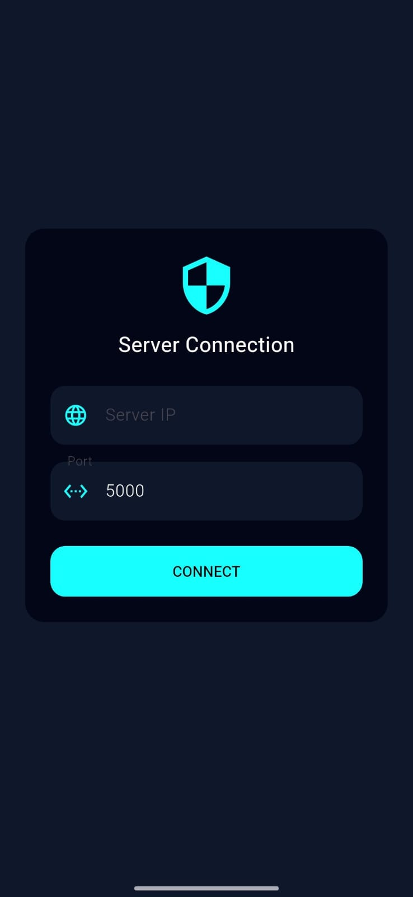
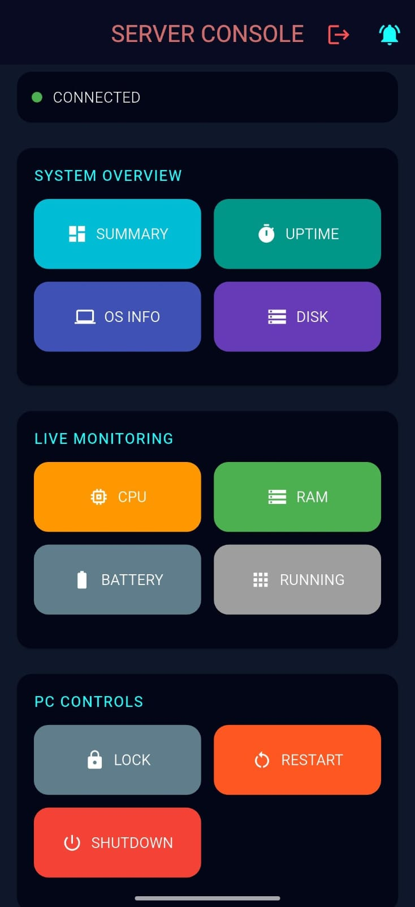

# Socket-Based System Monitor

A system monitoring project using a **Python socket server** and a **Flutter mobile app**.  
The mobile app communicates with the server over a network to fetch and display system information.

---

## Overview

* Python socket server handles client requests and system commands
* Database stores command logs and system usage data
* Flutter mobile app acts as a remote client for monitoring

This project demonstrates **socket-based communication between a server and a mobile application**.

---

## Python Socket Server

* Listens for socket connections
* Processes predefined command codes
* Returns system details (CPU, RAM, disk, uptime, OS info)
* Logs command activity in a database

**Location:** `python-server/`

---

## Mobile Application

* Built using Flutter
* Connects to the Python server via sockets
* Sends commands and displays server responses
* Provides a simple remote monitoring interface

**Location:** `mobile-app/`

---

## App Screenshots

  
  &nbsp;&nbsp;&nbsp;&nbsp;
  

  <b>Connect Screen</b>
  &nbsp;&nbsp;&nbsp;&nbsp;&nbsp;&nbsp;&nbsp;&nbsp;
  <b>Home Screen</b>

---

## Database

* Stores command logs and execution status
* Maintains system usage history
* Fully managed by the Python server

---
## Communication Flow

1. Mobile app sends a command  
2. Server processes the request  
3. System data/action is executed  
4. Response is sent back  
5. Command is logged in the database  
---

## Project Structure

~~~text
socket-based-system-monitor/
│
├── python-server/
│   ├── server.py        # Main socket server
│   ├── commands.py      # System command functions
│   ├── database.py      # Database logic
│   ├── check_db.py      # Database inspection utility
│   └── client_test.py   # Socket testing client
│
├── mobile-app/
│   ├── lib/
│   │   ├── screens/
│   │   │   ├── home_screen.dart
│   │   │   └── connect_screen.dart
│   │   └── services/
│   │       └── socket_service.dart
│   │
│   ├── android/
│   ├── ios/
│   ├── windows/
│   ├── linux/
│   ├── macos/
│   ├── web/
│   ├── assets/
│   ├── screenshots/
│   │   ├── connect_screen.png
│   │   └── home_screen.png
│   ├── pubspec.yaml
│   └── .gitignore
│
└── README.md
~~~

---

## Technologies Used

* Python (Socket Programming)
* Flutter (Mobile Application)
* Database for logging and monitoring
